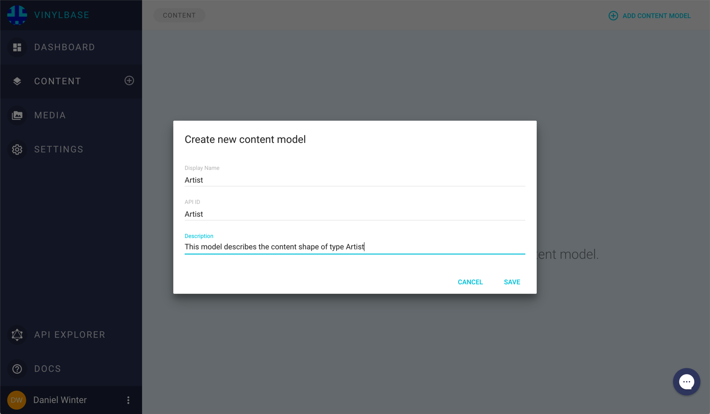

# Enumerations
Enumerations, enums for short, are not as commonly used in content projects, but don't let that cause you to believe they are not very powerful little structures! Because of their simplicity, we can make some assumptions that the available options *MUST* be one of the predefined options. 

If you have an enumeration that describes a book's print status as `In Print, Out of Print` - we know that it can only be one of those options and it forces content editors to use only of the allowed values.

For developers, have the ability to make assumptions about the data they are working with is a very helpful concept. [See the developer docs for more information.](../../developers/schemas.md)

When the question can be answered with one of a list of simple answers, enums are a good option.

This is a contrast to [Models](models.md) which are a collection of fields that can express complex objects like locations, job descriptions, published works and more.

--- WORK HERE

## Creating a Model
Creating a model is very easy! Click on the blue button "Create Model" and you'll be presented with a screen like this.

### Display Name
### API ID
### Description